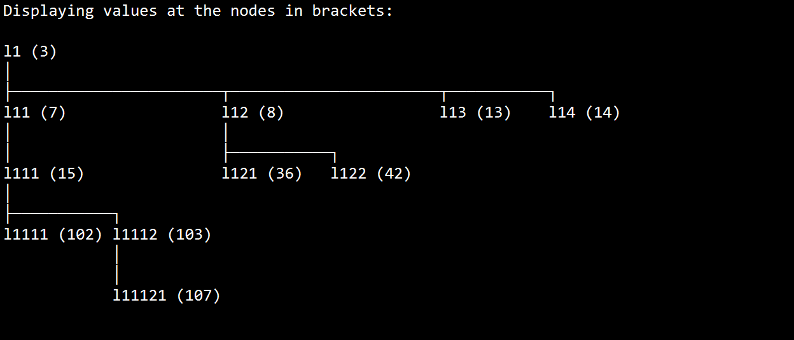

# PythonTreeDataStructure
Library with class of nodes that enable the creation and display of trees for decision taking, machine learning, etc.

When one displays the tree, it will look something like this:

            
An example notebook will be released soon...